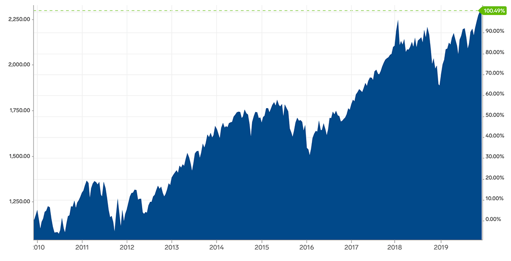
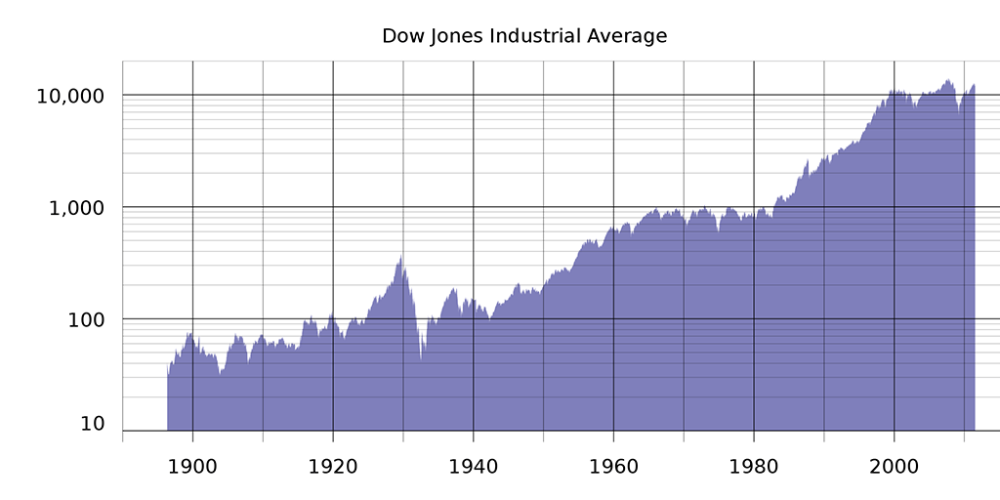
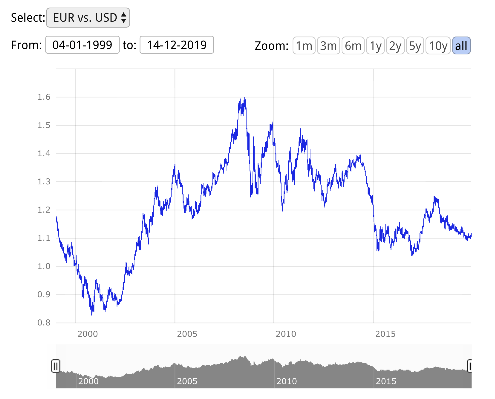
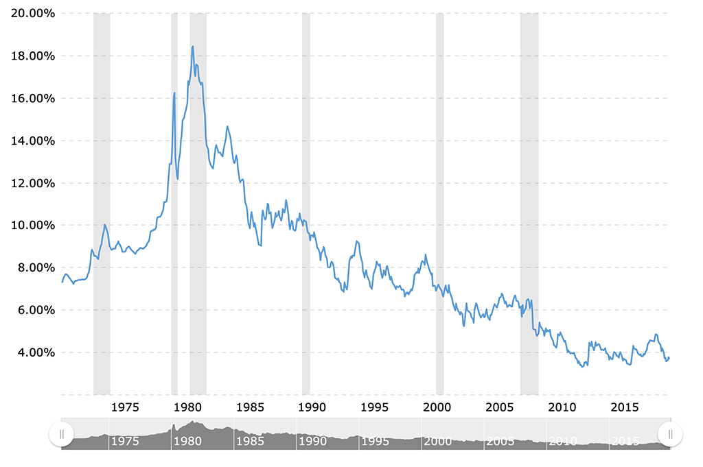

# How to Manage Money as a Techie
In this article, I will give you tips on how to manage money as a techie. I will summarize what I have done to successfully preserve and grow my wealth while keeping my strategy simple. I divide my wealth into 3 main and roughly equal parts; real estate, index funds (MSCI World Index, JPMorgan US Tech), and bonds. I prefer index funds over managing an investment account myself so that I will have a well-managed and well-diversified portfolio. I will also mention things that I have failed to do, so you can learn from them. I will explain all the terminology used in this article with quotes from Investopedia.

**Obligatory Disclaimer**: This is not investment advice, it just a summary of my own investment decisions and their results. Many investment banks offer free advice if you are seeking professional help. But before taking any action, do your own research.

Table of contents:
* [My Wealth Distribution as a Software Engineer](#my-wealth-distribution-as-a-software-engineer)
* [Why I Invest as I Do?](#why-i-invest-as-i-do)
* [Real Estate](#real-estate)
* [Index Funds](#index-funds)
* [Bonds](#bonds)
* [Cash and Other Liquidity](#cash-and-other-liquidity)
* [Others](#others)
* [My Failures](#my-failures)
* [Conclusion](#conclusion)

## Resources
You can find the video narration of this text on YouTube: [https://www.youtube.com/watch?v=GXgm1vvqgfQ](https://www.youtube.com/watch?v=GXgm1vvqgfQ){:target="_blank"}

<iframe width="560" height="315" src="https://www.youtube.com/embed/GXgm1vvqgfQ" frameborder="0" allow="accelerometer; autoplay; encrypted-media; gyroscope; picture-in-picture" allowfullscreen></iframe>

Video has additional tips and illustrations. If you want to read the comments or leave a comment, do so under YouTube video. If you want to contribute to the article, make a pull request on GitHub.

## My Wealth Distribution as a Software Engineer
Let me start by giving you the chart on how I allocate my wealth.

I keep to a straightforward formula of dividing my wealth into 3 roughly equal parts between real estate, index funds, and bonds. I keep a decent amount of liquidity in case of emergencies. Since funds can take up to 2 weeks to liquidate, it is important to have some cash in hand. I will expand on this 3-legged investment strategy point-by-point in the next sections.

I kept to this simple and diversified investment strategy for a long time now, and here is how it has been doing.
* Return on my real-estate investments was about 100%. This is based on the approximate sales value of adjacent and identical estates and is a rough estimate. I will explain why it grew so much in a moment.
* MSCI World Index Fund price doubled in the last 10 years.I got only about 60% return on my investment since I was late in getting into the index funds. I also started allocating some of my money for JPMorgan US Technology Fund, and it grew about 450% in the last 10 years, which I missed. I will discuss why I made this change later.
  
* The return on my JPMorgan Global Bond Fund was a modest 13% in the last 6 years.

My bond investments had minimal return, but the other 2 had an amazing run. This is not all luck though. These are the results of very conscious choices that I made while deciding what to do with my money. I will also talk more about it in a moment.

Tip: If you are looking for professional investment advice, a lot of banks would be more than happy to help you. However, remember that banks are just like all other businesses. They will prioritize their interests above yours, so do your own research before making final decisions.

## Why I Invest as I Do?
I am not a finance guy, so I do not keep daily track of the markets. Due to this, I like keeping my investment strategy as simple as possible. Do you remember the K.I.S.S. principle (keep it simple-stupid) from software design? This is a great place to apply it in real life. Just as in engineering, more complexity makes anything more error-prone. I also aim for a diversified portfolio to decrease volatility. I do not want to be thinking about my investments on a daily basis; rather, I want to concentrate on being productive. Having a safe and well-diversified portfolio ensures that. I can keep my mind clear of finance news and focus on my projects instead.

## Primary Objectives While Managing Money
Your primary objective is to preserve your wealth, and diversification is the key to this. Quoting from Investopedia:

> Diversification is a risk management strategy that mixes a wide variety of investments within a portfolio. A diversified portfolio contains a mix of distinct asset types and investment vehicles in an attempt at limiting exposure to any single asset or risk.
Source: https://www.investopedia.com/terms/d/diversification.asp

Also, keep it simple. The time you spend managing your investment is also a cost. In fact, if you are a high earner like an engineer, the time you spend managing money will be its highest cost. On the bright side, it is a good learning experience. However, try to avoid wasting time checking charts, but rather concentrate on learning the basics of economy and executing a good long-term strategy. And as a rule of thumbs, never ever, ever go into day trading. If you do now know what day trading is, let it stay that way. Trying to outtrade trading bots will always lose your money.

## Real Estate
What is real estate? Quoting from Investopedia:

> Real estate is property made up of land and the buildings on it, as well as the natural resources of the land, including water, minerals, etc.
Source: https://www.investopedia.com/terms/r/realestate.asp

As a tech person concentrating on your career, you do not want to buy land and bother building your own place. Instead, buy a safe and modern apartment or a house that will not create any problems for you.

Also, in engineering and tech, mobility is king. I personally like places a bit outside of the city, which tends to be cheaper and easier to sell. If you get a better opportunity in another city or a country, you can sell your place in no time and move on. At the end of the day, good business is where you find it. In addition, when you buy a place that is in a growing area rather than the heart of the city, your real estate valuation will grow with that area. That is precisely why my real estate doubled in price in about 5 years. New projects around the estate keep popping up, making the area increasingly valuable and desirable.

Do not forget that real estate is not risk-free. It is a physical and destructible object, so get whatever insurance you can. Also, when the markets crash, real estate markets also get hit hard, so make sure you limit your exposure by not buying more than what you need. However, real estate is also a good way of preserving value, and you will always need a place to live in. Living in your own estate is a joy and gives you peace of mind, which is worth the effort you put into finding the right place.

Tip: You need a safe and secure place to be productive. Especially as an entrepreneur and a creative person. Living in a great home will pay off in the long run.

## Index Funds
Index funds are my preferred type of investment in stocks. Partially quoting from Investopedia:

> An index fund is a type of mutual fund with a portfolio constructed to track a financial market index — for instance, the entirety of NASDAQ. An index mutual fund provides broad market exposure and low operating expenses. Warren Buffett has recommended index funds as a haven for retirement savings. Rather than picking out individual stocks for investment, he has said, it makes more sense for the average investor to buy all of the S&P 500 companies at the low cost an index fund offers.
Source: https://www.investopedia.com/terms/i/indexfund.asp

The most significant advantage of index funds is the ease of mind. You do not have to think about the performance of a single company or individual stocks. Markets tend to move up over time since stocks pay dividends. So, your investment in the index funds will grow along with the markets.

Also, index funds tend to have very low management fee. For instance, the MSCI World Index Fund that I invest in has a 0.2% management fee. As a result, you will lose little of your investment to managements costs, as there is very little to manage.

Recently I have started allocating more of my investments into technology index funds. As I already work in tech and believe in the future of tech, it is a good investment for me. However, I missed out on the meteoric rise of the tech sector in the last 10 years. If I were to invest in JPMorgan US Tech Fund early on, which invests in big tech companies like Google, Apple, Amazon, etc., I would have had a 350% return on my investment.

But do not forget, stocks in any form are high risks investments. In my opinion, you should plan not to sell for at least a decade if you plan on investing in stock-based funds.

On a side note, I should note that you can choose to invest in real-estate funds rather than investing in real estate directly. However, always check out the management fees, as they might erase your earnings in the long run.

Tip: Before you buy any fund, go to the bank's website, and read the funds' brochures. They will give you valuable data like historical performance, yearly costs, current holdings, and more.

## Bonds
Bonds are the final piece of the puzzle. Again, quoting Investopedia:

> A bond is a fixed income instrument that represents a loan made by an investor to a borrower (typically corporate or governmental). Bonds are issued by companies and governments to finance their projects and operations. Owners of bonds are debtholders, or creditors, of the issuer.
Source: https://www.investopedia.com/terms/b/bond.asp

Bonds are low-risk low-return investments and are a good way of preserving value rather than making money. The best thing about them is the ease of mind. They do not fluctuate much, and you do not have to think about them after investing. One thing to note is the fact that currencies themselves fluctuate.

For this reason, it is safest to choose a bond fund that has a mix of holdings in major currencies; USD, Euro, and Yen. Another risk is the corporate bankruptcies. You can mitigate that if you invest in funds that hold mostly government bonds.

Again, if you choose to go with funds, choose the ones with the lowest possible management fee. Bonds are already low yield investments, and high management fees would result in negative returns. You could buy Treasury bonds directly, but that requires an investment account, and I do not want to go there.

## Cash and Other Liquidity
This part is easy. Always have enough cash in hand for emergencies. Not only in your bank account but also physically, because you might lose access to your bank accounts at any moment due to a variety of reasons.

## Others
There are many more investment instruments like commodities etc. outside of what we discussed. But as I do not understand them, I never get involved with them. Also, I do not want to introduce any complexity and additional worries in my investment strategy. I am also not getting into retirement funds as they change wildly from country to country, and employer to employer, but you should investigate them as your longest-term investments.

## My Failures
I did not start investing in the stock market early on, so I could not ride the last economic boom. Especially the tech boom. Instead, I opted to pay back my mortgage as soon as possible. In my defense, I did not know that interest rates would stay low for so long. Check the below chart for yearly mortgate rates for the last 50 years:

I always planned for the worst-case scenario and prioritized being debt-free. However, it has the bonus effect of removing one complexity from your life.

Secondly, I invested in bonds heavily but did not diversify to multiple currencies, which resulted in significant fluctuations. They stabilize eventually, but it takes a bit of your cognitive capacity, and you do not want to be bothered with that. You would instead concentrate on your projects and career, which is what makes you more money than anything else.

## Conclusion
Before anything, invest in what you know the best, yourself! Invest in your education, invest in your career. Invest in your productivity, creativity, in anything that makes you a better person.

Also, invest in your side and main projects. However, be aware that failure is always an option, so be rather conservative. You cannot succeed without failure. Same goes for your investments. You might win or lose some money. In the aftermath, always reflect on your mistakes and do your research, to be more conscious about your next decision.

Tip: Money spent on what makes you productive is money well spent. Do not shy away from spending on your productivity tools like a good laptop, a suitable standing desk, etc. Quality tools always pay off.

After going all this trouble trying to preserve your wealth, one thing you should never do is to throw your money away with useless expenses. Not to mention the fact that showing off with your wealth is a childish thing. You never know if your current level of income will be sustainable forever. Tomorrow, you might need everything you have. Live a frugal life, and you will not regret it.

Live long and prosper.
