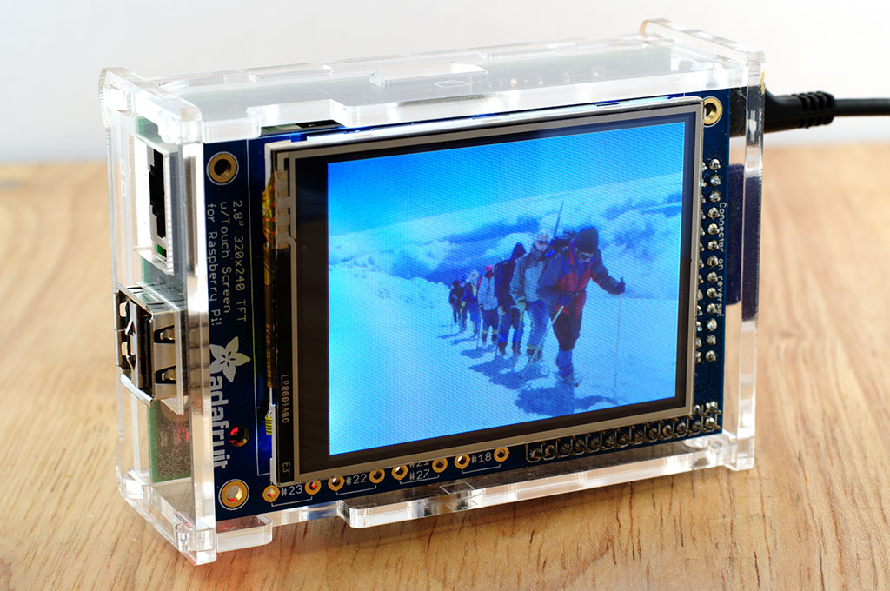
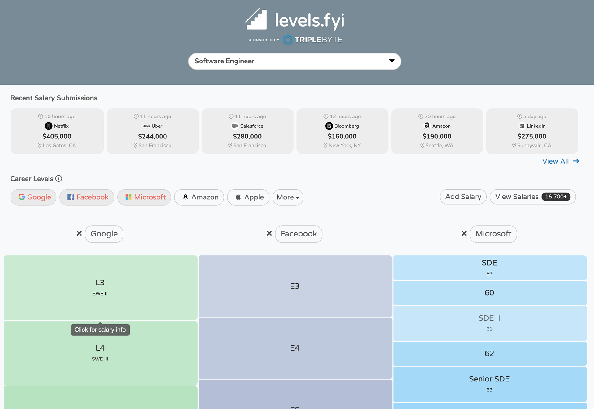

# What Is the Most Valuable Thing You Can Learn in One Hour?
This article will give you a list of the most valuable things you can learn in just an hour. There are many basic and valuable skills you can acquire in a very short amount of time, not only in technology but also in general life. Cooking, first aid & CPR, setting up a Raspberry Pi, cable management, or even learning to learn. These are all things that you can learn in under 60 minutes and will make a remarkable impact on your life. Obviously, learning is not mastering. Practice makes perfect, and you will have to practice over time to perfect your newly acquired skills.

## Resources
You can find the video narration of this text on YouTube with illustrations: [https://www.youtube.com/watch?v=8F_srpzXQ6o](https://www.youtube.com/watch?v=8F_srpzXQ6o){:target="_blank"}

<iframe width="560" height="315" src="https://www.youtube.com/embed/8F_srpzXQ6o" frameborder="0" allow="accelerometer; autoplay; encrypted-media; gyroscope; picture-in-picture" allowfullscreen></iframe>

Video has additional tips and illustrations. If you want to read the comments or leave a comment, do so under YouTube video. If you want to contribute to the article, make a pull request on GitHub.

Relevant articles referred to in this article:
* [Raspberry Pi Guide for Developers](/articles/raspberry-pi-guide-for-developers){:target="_blank"}
* [Software Engineer Compensation Guide](/articles/software-engineer-compensation-guide){:target="_blank"}
* [Money Management for Techies (which also describes bonds and index funds)](/articles/how-to-manage-money){:target="_blank"}

Hacker News discussion on the same topic:
* [https://news.ycombinator.com/item?id=21581361](https://news.ycombinator.com/item?id=21581361){:target="_blank"}

## Cooking
Cooking is probably the most valuable thing that you can learn in an hour. Cooking good food can save you a ton of time and money. It is also a great no-brainer activity to do after a heavy day of brain use. There are great tutorials to give you the fundamentals of cooking like preparation, seasoning, panning and baking. Cooking itself takes a great deal of time, but learning something new every day about cooking will take minimal time. It is also a great activity to do with friends; for instance, grilling outside when the weather is good.

Good cooking skills can help your camping quite a bit also. You can learn which local herbs you can use in your pot, or at least use an app to search for them. There is nothing like working on a new idea while your lunch is cooking by the campfire.

## Googling Effectively
When you are looking for a cooking fundamentals tutorial, you will pretty much have to Google it. If you are an engineer, nearly a fifth of your work time will be spent on Googling things (personal anecdote!). Thus, it is a good idea to spare an hour and learn how to use Google Search effectively. Here are some tips:

The easiest way to improve your Google search accuracy is to let the autocomplete do its job. Autocomplete will try and complete your queries based on many criteria like current trending questions, your search history, etc. It has a great chance of completing your query into a full question that has pre-ranked good answers.

Learn to use the Advanced Search feature of Google. After searching for something, you can click the "Settings" button right under the search bar. On that settings menu, click the "Advanced search" button, and you will see a form with a ton of settings. Options to narrow your search is especially useful. You can search for results from a certain part of the world or language, last update time, file type (like pdf), and more. You can quickly access similar settings for Google Image and Video search with the "Tools" button right under the search bar that appears after doing a search.

And finally, you can use search modifiers in your queries. Say you are looking for a song lyric and you do not remember some words. Type what you remember from the lyrics and use asterisk to substitute words that you do not remember. Say you remember the first sentence exactly; you can quote it to get an exact match. You can also use a minus sign to exclude words that you know is not related to your search. Try this and see what you get while keeping an eye on autocomplete suggestions: `Oh the "weather outside is frightful" but the * is so delightful -jackson`

## Cable Management
A lot of us have a lot of gadgets at home and work, and most of us live with a cable mess (not me!). There are many tools and strategies to manage this mess, which you can learn to utilize in no time. There are some nuances, and it is worth to invest a little bit of time in learning how to do this properly. For instance, bundling analog cables together might cause interference and result in lower quality. Or wrapping them around a metal object can end up creating an electromagnet. So, go and start Googling for online tutorials so you can get the most out of your workstation or home AV setup. You can start by learning how to properly wrap cables without damaging them, which is the least you can do.

Tip: If you have any ideas on skills that are essential and can be learned quickly, let me know in the comments section on YouTube for the video version of this article.

## Raspberry Pi
Raspberry Pi is a tiny computer with a powerful mobile CPU that costs only $35.

You can use it as a spare computer, you can use it as a home server, or you can make it into a smart home dashboard with a small screen attached. If you have no prior experience with electronics, it could be your gateway into electronics. You can buy many attachments for it like a temperature sensor, camera, GPS module etc. and build creative things with them. Programming a Raspberry Pi is quite easy, and it has good documentation. It can also help you get into programming if you choose to go in that direction.

You can get a Raspberry Pi Kit which includes everything necessary to turn your Raspberry into a replacement computer. If you go with a kit that includes a touch screen or a keyboard with integrated touchpad, you can even use it as a portable computer. There is so much to learn with a Raspberry Pi!

Tip: I have a separate article on how to setup a Raspberry Pi from scratch with the link in the resources section above. It is primarily aimed at programmers, but it can give you some tip on what techies like me do with their Raspberries. And no, we do not eat them!

## First Aid and CPR
Most schools and larger companies provide free education on first aid and CPR. If you have never done them, I highly recommend that you do. Most local healthcare providers also provide free lessons on these two, and you can catch the announcement on Facebook Events most of the time. It can even be a fun activity for a day with your pals!

At the minimum, have a first aid kit at your home.

They mostly come bundled with instructions, so read the leaflet. You can quickly learn how to attend burns and wounds with some online videos too, but make sure that it is from a credible source. Knowing the simplest things like how to apply pressure or do a tourniquet to stop bleeding can save somebody's life, or even yours!

## Salary Negotiation
Most of us will always receive a salary for most of our lives and being able to negotiate properly is a life changer. Even if you are an entrepreneur, have your own business, you will still have to negotiate your compensation package with your investors. So, learning to negotiate your compensation is an essential yet mostly ignored skill.

There are a million guides out there each tailored towards a specific industry. Now that you know how to Google effectively, go ahead and check out the guides that fit you the best. You can bookmark them and read or watch them while commuting. Let me give you a couple of tips that apply to everyone:

First off, know your worth. Knowing where you stand on the income chain will help you negotiate effectively. There are many websites that list salaries for different industries and companies like LinkedIn Salaries, Glassdoor Salaries, level.fyi and more.

Search for salary listing sites that are relevant to your line of work and use them.

Tip: I have a separate compensation guide for software engineers. If you are in software or similar engineering discipline, you can go check it out. It will help you in estimating what your compensation should be for the next year. The link is in the resources section.

## Bonds and Funds
You might not be individually investing in bonds or funds, but your retirement fund is doing that for you. In many countries, monthly investment into a retirement fund is either obligatory or is highly advised. It is good to know where your money is going to for your entire working life, so learning about bonds and funds is essential. I especially recommend learning about index funds, which invest in a very diverse portfolio of stocks. Many funds also invest in bonds, to further diversify their investments.

Tip: I have yet another dedicated guide on how to manage money for people with little knowledge about investing. I also talk about how I make my long-term investments to preserve and grow my wealth in that article. If you are interested, the link is in the resources section.

## Presentation
Presenting information is easy to learn and hard to master skill. There are different mediums to share information: in writing, using slides, or just public speaking. As long as you use the right templates and obey the rules of information sharing, you will mostly be well received. However, there are many diverse techniques to use based on what you are presenting. Just go ahead and Google: "How to present an idea" and you will find a wealth of information online. There are great many PowerPoint, or Google Slides templates out there which can help you in structuring your presentation. Use them as a starting point, and you can gradually personalize as you get more proficient.

Tip: I have a bombshell of an article coming up on how to present ideas and products like Apple does. If you want to read it when it comes out, keep an eye on quanticdev.com

## Asking a Question
You should learn how to ask a good question. Asking a clear and concise question is a skill of its own, but you can improve yourself with a tiny bit of time investment. You do not even need a guide for this. All you have to do is just a bit of self-reflection. Are you asking short and concise questions, or are you sneaking multiple questions into one sentence? Are you speaking clearly? Are your sentences too long? Reflect on the responses you got for your past questions and try to identify your strengths and weaknesses and work on them.

My best advice for you would be to ask the question in your mind to yourself and try to answer it from another person's perspective. Sometimes, while thinking of an answer, you will find one! Other times, the rehearsal you just made will help you speak more clearly and fluently, which will make the listener's job easier. 

## Learn to Learn
You saw this one coming! If you want to learn, you need to know how to learn effectively (yeah, it's a compilated sentence). First off, if you want to learn something new, you need to have the willingness to learn. After that, you need to concentrate. Leave everything aside for an hour and put your mind to the task. And after you cram a ton of information into your brain, you need to practice it. Most things that you want to learn will also necessitate mastery, which only comes with practice. One of the best ways of practicing stuff is hobby work. Say you have just mastered the art of cooking. Go ahead and prepare a dinner for your family. If they survive the experience, then do it again and again!

In addition, teaching is one of the best ways of learning and re-learning. It is exactly the reason as to why I do these guides and write articles for them. If you sit on your newly acquired skills, they will disappear into the void. Instead, you can try and teach them to other people, make some short videos on them, or put them in writing so others can benefit from year learnings.

## Conclusion
Not all skills require oceans of time to acquire. There are hundreds of things that you can learn in no time, which would make remarkable improvements in your life. Optimizing your life in small ways will gradually give you more time to do the things you like. You just need to keep your practice game up not to lose your sharpness.

And finally, keep an eye on this website if you want to keep on learning. I am primarily putting out all this info for my own, but they will also help you to get better at living, creating, and engineering. When I need to preserve more of my skills, I will put more guides up, and I will see you then.
